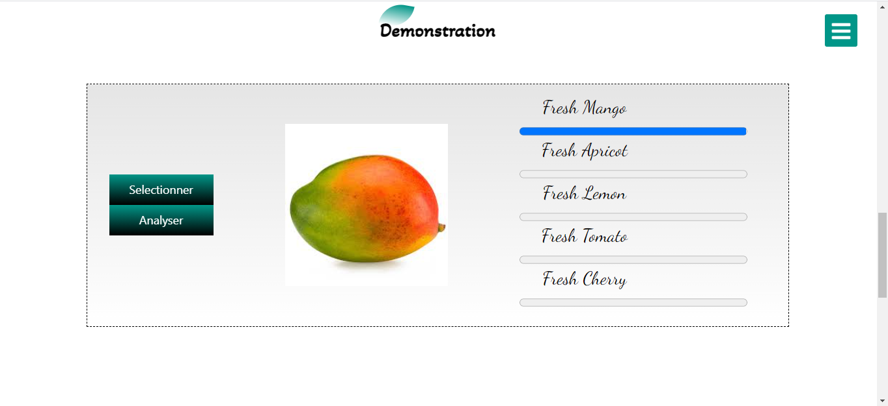

# DEEPFRUITS


## A propos


DeepFruits offre la possibilité d'identifier le type et l'état des fruits, en s'appuyant sur les réseaux de neurones convolutifs.
***
DeepFruits est développé par OUAKIB Amine et RAMADI Hamza dirigés par Mme ZAHIR Jihad à la Faculté des Sciences Semlalia Marrakech, Département d'Informatique
## Préparation de l'environnement
***
Ce projet est développé en language Python, la première etape est le téléchargement et l'installation de python 
[Télécharger Python](https://www.python.org/downloads/).

les bibliothèques utilisé sont détaillées avec leurs versions dans le fichier [requirements.txt](requirements.txt)
, on peut simplement les installer avec la commande :
```bash
pip install -r requirements.txt
```

## Démarrage de serveur
*** 

une fois l'environnement est préparé le serveur peut être lancé avec la commande

``` bash
python app.py
```
ou bien

``` bash
py app.py
```


## Démonstration
***

l'objectif de notre application est de faciliter à l'utilisateur d'évaluer notre système qu'on a développé . Dans cette partie l'utilisateur trouvera deux boutons ,le premier pour importer l'image puis le deuxième pour lancer le processus de prédiction et obtenir le résultat.



## Contribution
***

le manque du dataset est l'un des problème rencontré lors du développement de ce projet, alors l'utilisateur peut contribuer à travers la collecte des images qu'il fournira, en cliquant sur le bouton Ajouter qui s'affiche dès que l'image soit prédite avec au moins 90% d'exactitude.


Ces images là vont être consultées périodiquement par l'équipe du projet qui sélectionnera les bonnes images qui vont enrichir le dataset et ré-entraîner le modèle sur le nouveau dataset.
